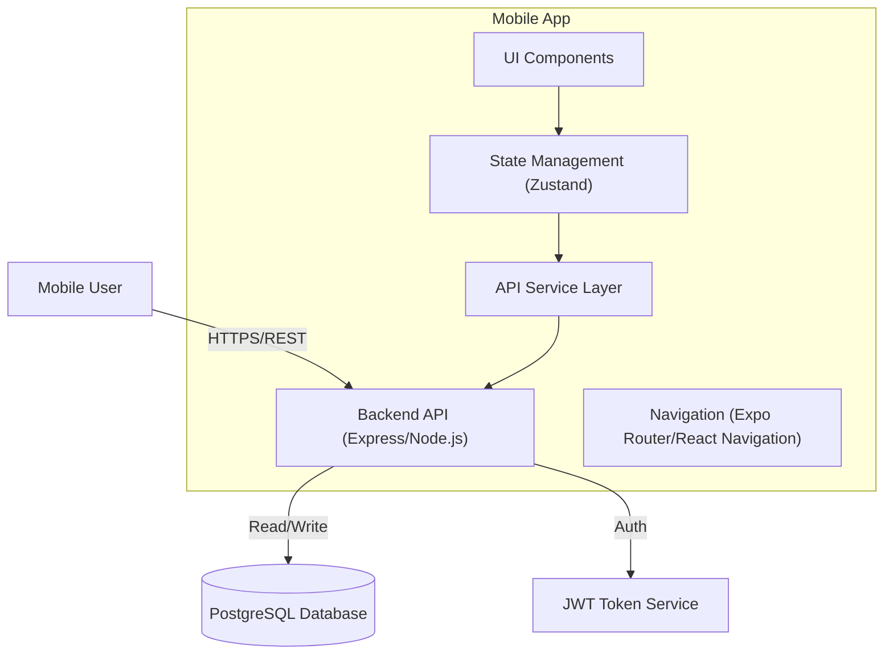

# System Architecture - Naxum Assessment

## Overview
This project consists of a mobile application built with React Native (Expo) and a backend API built with Node.js and Express. The system is designed to manage a direct sales team hierarchy, handling authentication, contact syncing, and task assignment.

## 1. System Architecture Diagram



## 2. Key Technical Decisions

### Mobile App (React Native + Expo)
*   **Framework**: Expo (Managed Workflow) for rapid development and easy deployment.
*   **Language**: TypeScript for type safety and maintainability.
*   **State Management**: **Zustand**. Chosen for its simplicity, minimal boilerplate, and ease of use compared to Redux, while still providing sufficient power for the required features (auth state, team data, tasks).
*   **Navigation**: **Expo Router** (file-based routing) or React Navigation (stack based). We will use Expo Router as it is the modern default for new Expo apps.
*   **UI Library**: Custom components with robust styling (using `StyleSheet`) to ensure a "Premium" look without fighting a heavy UI framework's defaults, supplemented by `react-native-vector-icons` (via Expo).
*   **Contact Sync**: `expo-contacts` for permission handling and fetching local contacts.

### Backend (Node.js + Express)
*   **Framework**: Express.js. Lightweight and flexible.
*   **Database**: PostgreSQL. Robust relational database ideal for hierarchical data (User teams).
*   **ORM**: **Sequelize**. chosen for its strong TypeScript support (`sequelize-typescript`) and ease of defining models and relationships.
*   **Auth**: JWT (JSON Web Tokens) for stateless authentication. Passwords hashed with `bcryptjs`.
*   **Validation**: `class-validator` for request DTO validation.

### Scalability Considerations (1000+ Team Members)
*   **Pagination**: Implement cursor-based or offset-based pagination for the "Team View" and "Contact List" endpoints to handle large datasets efficiently.
*   **Caching**: In a real-world scenario, we would implement Redis caching for the team hierarchy endpoints, invalidating the cache only when the tree structure changes (new invites).
*   **Hierarchy Structure**: Storing `inviter_id` (Adjacency List) is simple for this assessment. For very deep trees, a Closure Table or Nested Set model would be more performant for read-heavy operations, but Adjacency List is sufficient for 1000 members and simpler to implement within 48h.

## 3. Team Process & Code Quality
*   **Git Workflow**: Feature branch workflow. `main` is production-ready.
*   **Testing**: 
    *   **Backend**: Jest for unit tests of Services (business logic) and Supertest for Integration tests of Controllers.
    *   **Mobile**: Jest + React Native Testing Library for component and hook testing.
*   **Code Style**: ESLint + Prettier enforced. Strict TypeScript checks enabled.

## 4. Directory Structure

### Backend
```
src/
  config/         # DB connection, env vars
  controllers/    # Request handlers
  middleware/     # Auth, Validation, Error handling
  models/         # Database models (Sequelize)
  routes/         # Route definitions
  services/       # Business logic (Critical for testing)
  types/          # TS Interfaces
  app.ts          # App entry point
```

### Mobile
```
app/              # Expo Router screens
components/       # Reusable UI components
hooks/            # Custom hooks (business logic)
services/         # API client
store/            # Zustand stores
constants/        # Colors, Fonts
types/            # TS Interfaces
```
