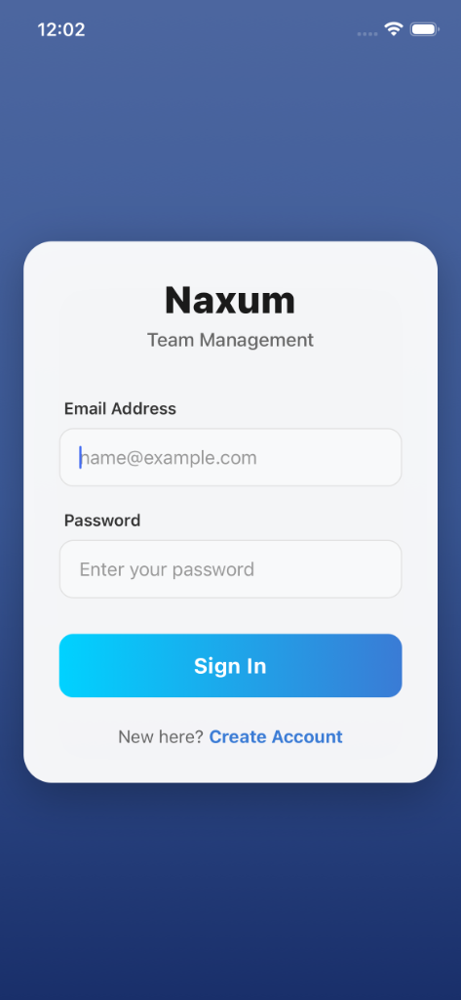
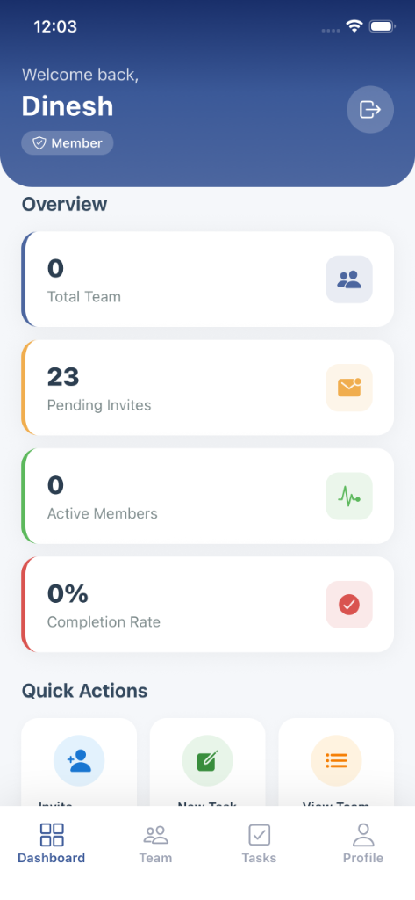
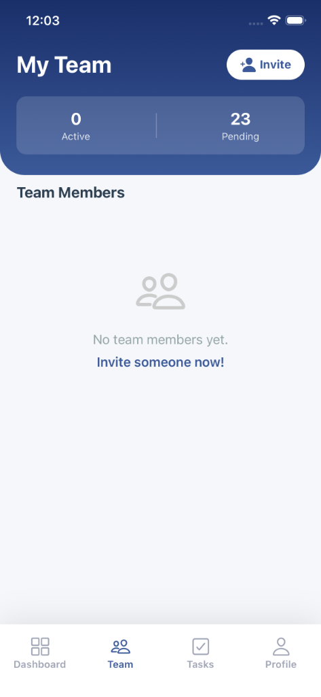
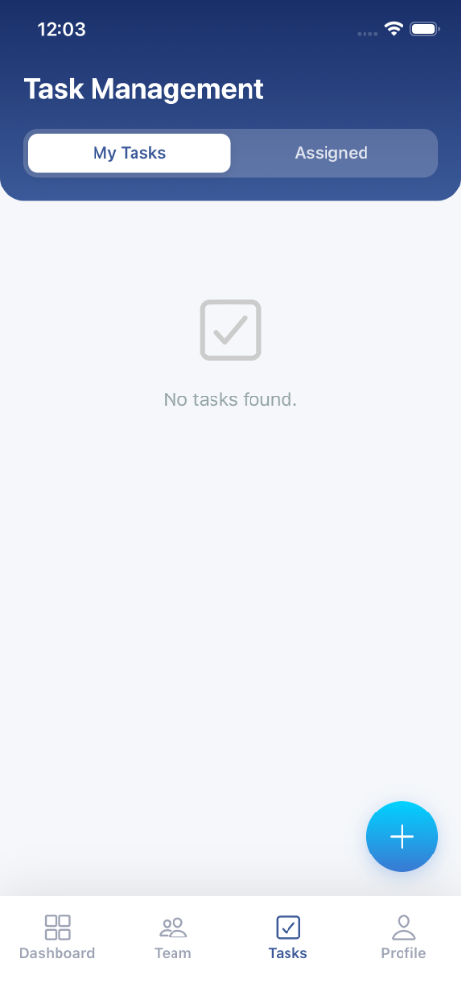
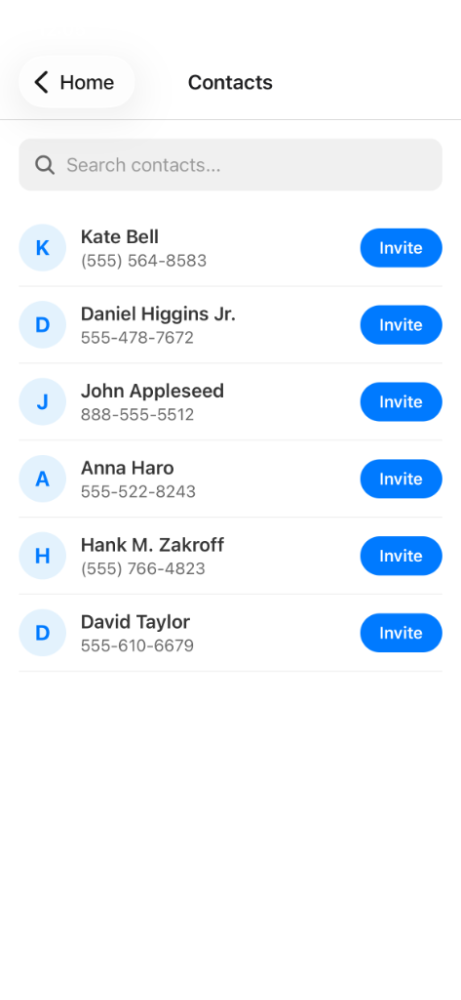
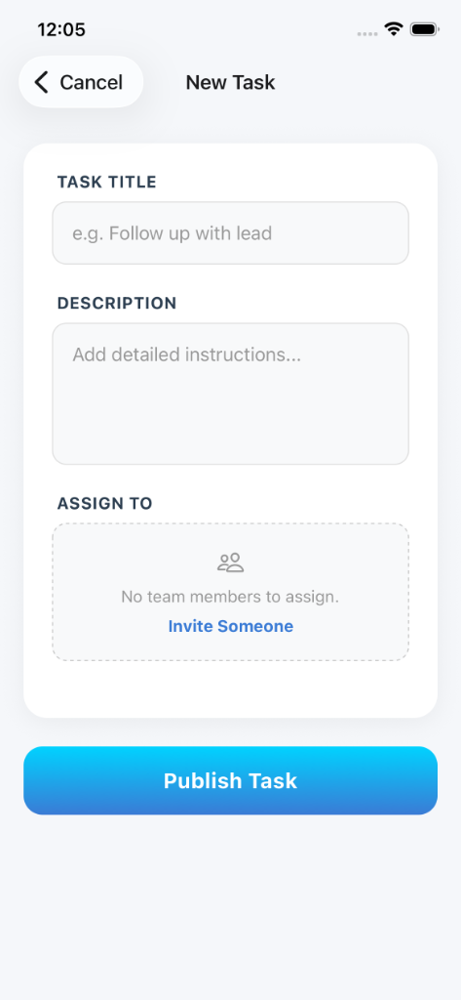

# Naxum Assessment Submission - Dinesh Kokare

## 📦 Deliverables

This repository contains the complete source code and documentation for the Naxum Sales Team Management App assessment.

### 1. Source Code
*   📱 **[Mobile App](./dineshkokare-mobile-app)**: React Native (Expo) application.
*   🚀 **[Backend API](./dineshkokare-backend)**: Node.js/Express API with PostgreSQL.

Each folder contains its own `README.md` with detailed setup and running instructions.

### 2. Architecture Document
*   📄 **[System Architecture & Technical Decisions](./ARCHITECTURE.md)**
    *   System Diagram
    *   State Management Rationale (Zustand)
    *   Scalability Strategy (1000+ members)
    *   Team Processes

### 4. Video Demo
[](https://www.loom.com/share/4f33567a52ef415ab62bb35ec481d4f7)

**Watch Video:** [https://www.loom.com/share/4f33567a52ef415ab62bb35ec481d4f7](https://www.loom.com/share/4f33567a52ef415ab62bb35ec481d4f7)

*   📖 **[Step-by-Step SOP Guide](./APP_WALKTHROUGH.md)**

---

## ✅ Assessment Checklist

- [x] **Source Code**: Separate folders for Mobile and Backend.
- [x] **Documentation**: Setup instructions, Env vars (`.env.example`), and Architecture doc.
- [x] **Quality**: Clean Git history, meaningful commits, and unit tests (6+ test files).
- [x] **Video**: App walkthrough and code explanation.
### 5. Screenshots
| Login | Dashboard |
| :---: | :---: |
|  |  |

| Team | Tasks |
| :---: | :---: |
|  |  |

| Invite Flow | Task Creation |
| :---: | :---: |
|  |  |

---

## 🏃‍♂️ Quick Start

1.  **Backend**:
    ```bash
    cd dineshkokare-backend
    npm install
    npm run dev
    ```

2.  **Mobile App**:
    ```bash
    cd dineshkokare-mobile-app
    npm install
    npx expo start
    ```
