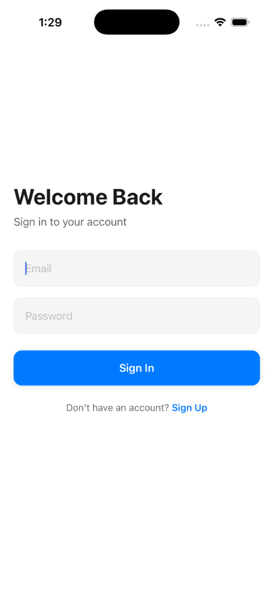
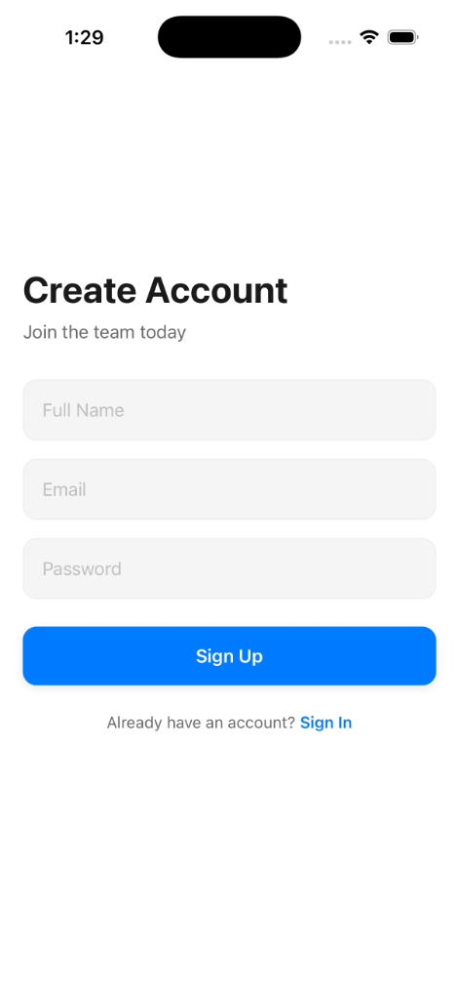
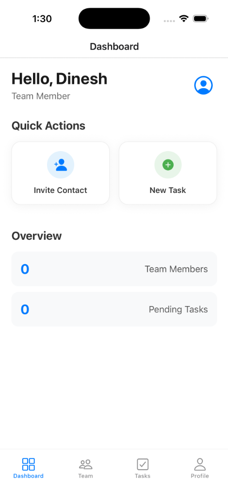
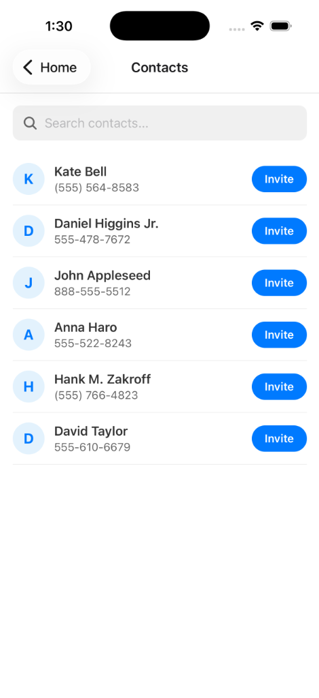
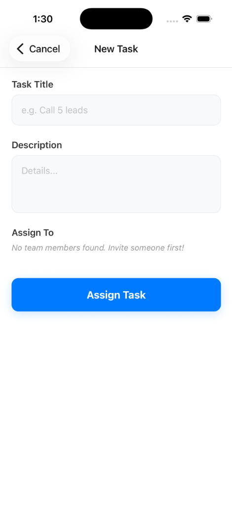

# Naxum VP of Mobile App Assessment

This repository contains the solution for the Technical Skills Assessment.

## Structure
*   **`mobile-app/`**: React Native (Expo) application.
*   **`backend/`**: Node.js (Express) API.
*   **`ARCHITECTURE.md`**: Detailed architectural decisions and diagrams.

## Quick Start
1.  Navigate to `backend` and run `npm install && npm run dev`.
2.  Navigate to `mobile-app` and run `npm install && npx expo start`.
3.  Ensure you have a PostgreSQL database running (see backend README).

## Deliverables
*   Source Code: Included in this folder.
*   Architecture Doc: `ARCHITECTURE.md`.
*   Video Demo: (Link to be added by candidate).

## Testing
Run `npm test` in the `backend` directory to see unit tests for business logic.

## App Screenshots

| Login | Register | Dashboard |
|:---:|:---:|:---:|
|  |  |  |

| Contacts | New Task |
|:---:|:---:|
|  |  |

